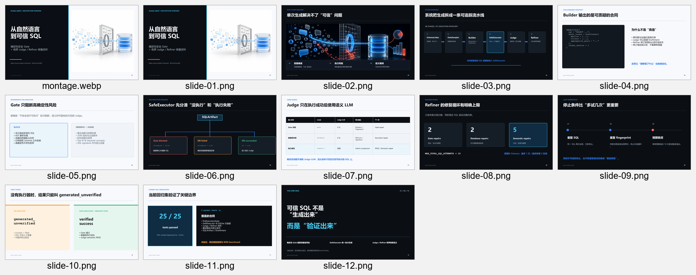
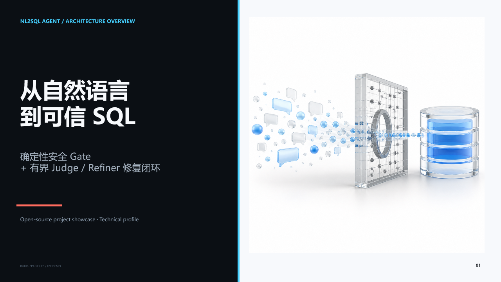
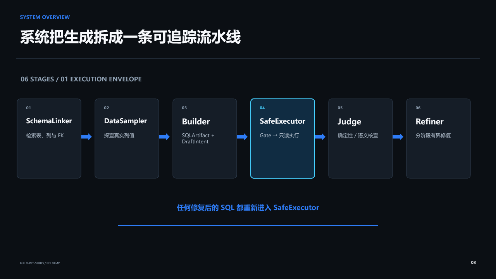
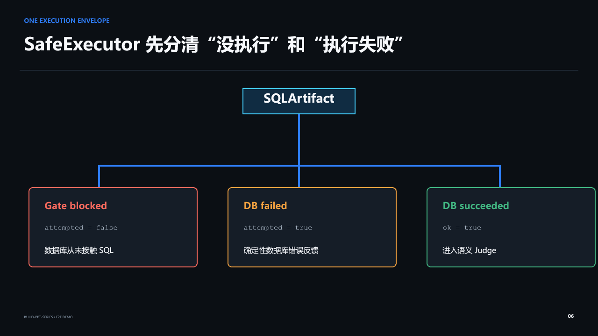

# Build PPT Series

[简体中文](README.md) | [English](README.en.md)

`build-ppt-series` 是一个可移植的 Agent Skill，用于从资料、参考 PPTX、品牌规范或
已有 `spec_lock` 创建单份演示文稿和连续系列 PPT。它把内容规划、模板约束、配图决策、
按需插图生成、导出和验收组织成可恢复的项目，而不是只生成一个不可追踪的文件。



## 核心能力

- 新风格、参考模板、已有 `spec_lock` 和现有 PPT 优化四种入口；
- 系列级 `spec_lock` 与单份 PPT 的 `deck_plan` 分离，保持同系列但不机械复刻；
- 每份 PPT 先依据本次材料独立估算页数和内容结构，再应用系列视觉规范；
- 检测同页数且逐页功能、版式高度对应的机械复刻风险；
- 完整审查并保留用户模板，按内容功能选择版式；
- 配图优先级：用户图片 → 来源材料/模板图片 → 可授权外部图片 → 真实截图 → 原生图表 → 生成插图 → 无图；
- 先做全局视觉规划和一次集中检索，实际制作页面时才按需生成插图；
- 插图生成前检查后端、比例、风险和预算，每个资产最多自动尝试两次；
- 失败时保留 `插图待补充` 占位框、完整提示词和失败记录，不中断其余页面；
- PPTX/SVG 结构检查、素材来源校验、逐页渲染与视觉验收。

仓库已定义 7 类场景、14 个审美方向及“硬排除后等概率随机”的选择机制。这些方向用于
校准“内容充实、层级清晰和真实可用”的判断，不提供可复制版式。原创参考页尚未完成制作
和人工审核，因此当前生产流程会拒绝自动使用这些未审核集合，而不是把文字方向冒充模板。

## 后端关系

这个 Skill **独立于 PPT Master**。工作流、`spec_lock`、视觉规划和质量门都属于本项目，
但生成可编辑 PPTX 仍需要宿主提供演示文稿后端。

| 环境 | 默认演示文稿后端 | 图片生成 | PPT Master |
|---|---|---|---|
| Codex | 宿主 `Presentations` | 宿主 `imagegen`（若可用） | 不需要 |
| Claude Code | 用户配置的原生 PPTX 后端 | 用户配置的等价后端 | 仅本包 SVG→可编辑 PPTX 路线需要 |
| 其他 Agent | 已验证的原生后端 | 可选 | 不要求 |

没有图片生成能力并不妨碍制作不需要生成插图的 PPT；只有视觉计划明确包含 `generated`
任务时，才必须在排版前解决图片后端问题。整页栅格化只能在用户明确接受后使用，并标记
`editable: false`。

## 安装

克隆仓库后，将仓库内的 Skill 目录复制到 Agent 的 Skill 目录，并保持文件夹名为
`build-ppt-series`。在 Codex 中，从仓库根目录运行：

```bash
mkdir -p "${CODEX_HOME:-$HOME/.codex}/skills"
cp -R skill/build-ppt-series "${CODEX_HOME:-$HOME/.codex}/skills/build-ppt-series"
```

重新打开任务或刷新 Skill 列表后使用：

```text
使用 $build-ppt-series，根据我提供的资料制作一套同系列 PPT。
```

## WSL 快速检查

在 WSL 中运行项目脚本；Codex 的 Presentations 导出链可能调用宿主 Windows 运行时，这是
正常的双环境分工。

```bash
python3 scripts/environment_check.py --executor codex --image-backend available
python3 scripts/init_series.py ./example-series \
  --series-name "Example Series" \
  --profile technical \
  --deck-id 01-introduction \
  --deck-title "Introduction"
```

如果图片能力未知，使用 `--image-backend unknown`。不要在能力未知时承诺生成插图。

## 项目结构

```text
<series-root>/
  series/
    spec_lock.md
    template/
    shared-assets/
    history/
  decks/<deck-id>/
    spec_lock.md
    sources/
    images/{candidates,sourced,generated}/
    analysis/
      deck_plan.md
      visual_asset_plan.json
      image_briefs/
      generation_records/
    svg_output/
    notes/
    exports/
    backup/
```

系列锁只保存跨章节不变量；页面顺序、内容节奏和本章特殊要求留在单份 PPT 目录中。

## 端到端示例

本仓库包含一份基于真实本地代码仓库制作的 12 页技术展示：
[`NL2SQL Agent：从自然语言到可信 SQL`](examples/nl2sql-agent-showcase/decks/01-overview/exports/NL2SQL_Agent_Overview.pptx)。







示例使用 2 张按需生成的概念插图、9 页原生可编辑视觉和 1 页纯文字收束。完整验收记录见
[`ACCEPTANCE.md`](examples/nl2sql-agent-showcase/ACCEPTANCE.md)。

## 验收原则

最终交付必须报告实际后端、可编辑性、页数、结构检查、渲染检查、素材状态、未解决占位符
和已知限制。结构校验不能冒充视觉验收；每一页都需要渲染并单独检查。

## 许可证

Apache-2.0，见 [LICENSE](LICENSE)。
